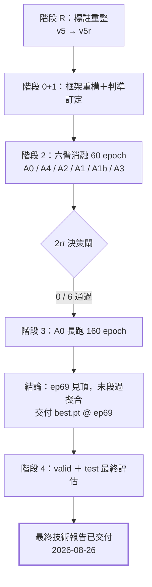
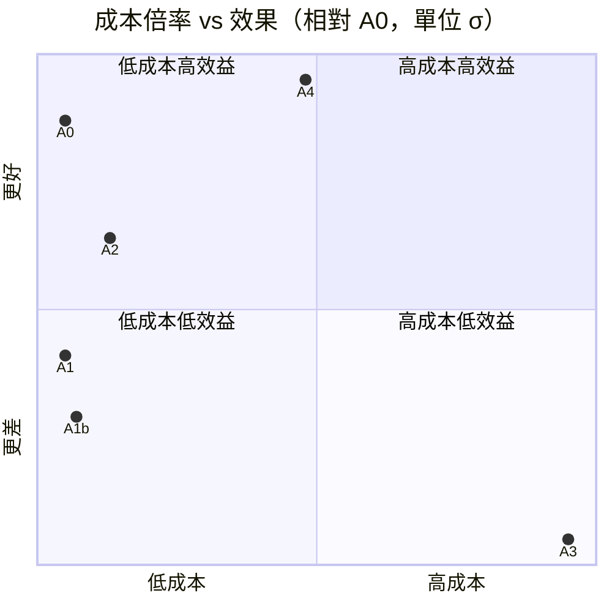
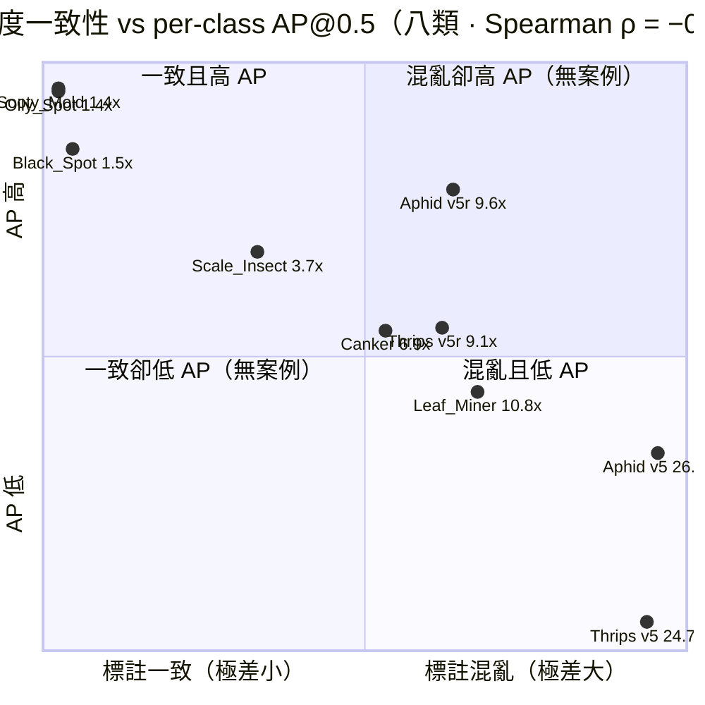
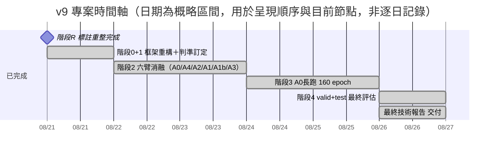

# v9 專案階段性進度報告

**報告日期**：2026-09-02（初版 2026-08-25）　**對象**：週三進度會議　**範圍**：階段 2 六臂消融 · 階段 3 長跑 · 階段 4 最終評估 · 最終技術報告（全部完成，v9 技術路線結案）
**資料來源**：`docs/v9_記錄_實驗重整與六臂消融.md`、`docs/v9_結果_最終評估_valid與test.md`、`docs/archive/v8_報告_模型訓練評估.md`、`docs/v5r_說明_資料集建置與標註重整.md`、`docs/通用_參考_評估指標與公式.md`（本報告所有數字均可回查上述文件）

---

## 摘要

- **最終模型已定案**：`best.pt` @ epoch 69，於**從未使用過的 test 集**上取得 mAP@0.5 = **0.8908**、mAP@0.5:0.95 = **0.6783**，Precision 0.8995，Recall 0.8614。架構為原封不動的官方 `yolo26-p2`，載入不需任何自訂模組。
- **六臂消融（A4／A2／A1／A1b／A3，以 A0 為對照組）全數未通過 2σ 顯著性門檻。** v9 的三項原創技術手段——自訂損失函數 Wise-Inner-MPDIoU、ADown 下採樣、StarTripletBlock——對指標沒有正貢獻，且成本越高、結果越差。
- **唯一有效的改動在資料端，而且是被預測到的。** 訓練開始前，八類的「標註尺度極差 ↔ AP」量出 Spearman **ρ = −0.976**，並據此寫下預測「Thrips 有機會從 0.572 拉到 0.75 附近」；重標後實測 valid **0.797**、test **0.910**——**預測命中並超出，且全程 0 GPU-h、架構完全未動**（見 §6）。
- **160 輪的訓練排程過長。** 模型在第 69 輪見頂，之後持續下滑，第 160 輪的權重反而低了 0.015。末段為純粹的過擬合。
- **誤差結構單純且集中。** test 上八個類別之間**沒有任何互相誤判**（v8 在 valid 上還有 9 次），全部錯誤皆為背景誤報或背景漏檢，其中 Scale_Insect 一類即佔誤報的 78%、漏檢的 76%。

---

## 1. 背景與方法

專題目標是得到 mAP、Recall 等指標**優於既有 `YOLO26n_P2_Citrus_MuSGD_v8`** 的模型。自訂損失函數、ADown、StarTripletBlock 都只是達成這個目標的**手段**，不是必須保留的研究產出——任何手段只要無法帶來可驗證的指標提升，就直接剔除。

判準採兩項原則，均與 v8 舊報告的做法不同：

1. **用平台期均值，不用單一 best-epoch。** v8 報告引用的 82.08%（epoch 69）其實是 50 輪平台期（80.38% ± 0.69%）的抽樣最大值——只要跑得夠多輪，就算模型能力不變，best-epoch 也有約一半機率「看起來更高」。內部決策一律採平台期均值 ± 標準差。
2. **顯著性門檻用 A0 自己的標準差校準，不沿用 v8 的舊值。** 標註重整後 per-class 實例數與雜訊分佈都變了，門檻定為 **A0 平台期均值 + 2σ**（σ 取 A0 自身平台期的標準差）。

---

## 2. 六臂消融是什麼：白話版

一句話說完：**A0 是完全照官方預設、不加任何改動的對照組；其餘五臂各自改一個地方，賭這個改動能不能讓模型更準。** 沒有 A0，就無法判斷其他五臂的漲跌是真的改動有效，還是訓練本身的隨機波動。

| 臂 | 改了什麼（白話） | 賭的是什麼 |
| --- | --- | --- |
| **A0** 對照組 | 完全照官方預設架構訓練，不加任何自訂模組 | 作為比較基準，沒有它無法判斷其他臂是否真的更好 |
| **A4** 放大圖片 | 輸入圖片從 640×640 放大到 800×800 | 圖放大，薊馬這類極小目標應該更容易被看清楚、抓到 |
| **A2** 換一種縮圖方式 | 模型內部「壓縮特徵圖」的步驟，從標準做法換成 ADown | 號稱在壓縮的同時保留更多細節，少丟資訊 |
| **A1** 換一種評分標準 | 「框畫得準不準」的計分公式，換成更複雜的 Wise-Inner-MPDIoU | 複合式評分應該能更精細地修正框的位置 |
| **A1b** A1 反著調 | 跟 A1 同一套公式，只把其中一個關鍵參數（ratio）反過來 | 檢驗 A1 表現不好是否只是參數方向調錯了 |
| **A3** 換一種看圖模塊 | 負責萃取淺層細節特徵的模塊，換成 StarTripletBlock | 號稱更擅長辨認小而密集的目標 |

**結果先講在前面**：六個賭注，五個全輸，且改動成本越高、輸得越慘（詳見下節表格）。唯一沒被否證的是 A4（打平，不算贏也不算輸）。真正讓數字變好的，不是這六個架構賭注，而是更早一步、不在這六臂之列的「標註重整」（v5 → v5r）。

---

## 3. 六臂消融結果

**基準 A0**（官方 `yolo26-p2` 架構 ＋ 內建 CIoU ＋ v5r，60 輪）：mAP50-95 平台期（最後 16 輪）= **0.63399 ± 0.00383**，2σ 門檻 = **0.64165**，151.3 秒／輪。

| 臂 | 改動內容 | mAP50-95 平台期 | Δ vs A0 | σ 倍數 | 判定 | 成本倍率 |
|---|---|---:|---:|---:|---|---:|
| A0 | 基準 | 0.63399 | — | — | 基準 | 1.00x |
| A4 | imgsz 640→800 | 0.63652 | +0.00253 | +0.7σ | 無差異 | 1.59x |
| A2 | stride-2 Conv→ADown ×6 | 0.62657 | −0.00742 | −1.9σ | 疑似變差 | 1.11x |
| A1 | CIoU→Wise-Inner-MPDIoU（ratio=0.70） | 0.61938 | −0.01461 | −3.8σ | 顯著變差 | 1.00x |
| A1b | 同上，ratio=1.25 | 0.61562 | −0.01837 | −4.8σ | 顯著變差 | 1.03x |
| A3 | C3k2→StarTripletBlock ×3 | 0.60789 | −0.02610 | −6.8σ | 顯著變差 | 2.25x |

**六臂全數未通過門檻，且呈現清楚的規律：改動越貴，結果越差。** A3 同時是成本最高（2.25x）與結果最差（−6.8σ）的一臂。

**逐臂重點**（per-class 細節見 `docs/v9_記錄_實驗重整與六臂消融.md`；此處只列機制結論）：

- **A4（+0.7σ，無差異）**：付出 59% 的時間只換到 0.7σ。根本原因是標註重整已經先把「小目標」問題解決了大半——Thrips 的框中位數從 v5 的 106.6px 變成 v5r 的 218.6px，不再是小目標，提高解析度的邊際效益因此被稀釋。
- **A2（−1.9σ，疑似變差）**：Scale_Insect 背景誤報從 489 暴增到 592（+103），是最大反例。GFLOPs 量測顯示 ADown 比 stride-2 Conv 省 14%，但實測反而慢 11%——**FLOPs 不是延遲的可靠代理**，後續估成本一律以實測秒／輪為準。
- **A1（−3.8σ，顯著變差）**：AP50 大致持平，AP50-95 六類下降——是「找得到但框不準」的定位精度劣化樣態，且隨訓練越拉越大，非單次雜訊。
- **A1b（−4.8σ，比 A1 更差）**：這是關鍵測試——把 ratio 方向反過來（0.70→1.25）確實讓偵測變好（mAP50 回升），但定位更差（mAP50-95 再掉），證明問題不在 ratio 的方向，是整個複合損失函數（WIoU＋MPD＋Inner 三項相加）本身不適合這個任務。
- **A3（−6.8σ，最差且最貴）**：7/8 類 AP50-95 下降。唯一正面訊號是背景誤報最少（總 FP 582→523），但代價是全面性的定位精度下滑。

**判準的誠實限制**：上表的 σ 是**單次執行、epoch 內**的變異，不是重複執行的 run-to-run 變異（後者通常更大）。A3／A1b／A1 的偏移幅度夠大，即使算入 run 間變異仍然成立；但 **A2（−1.9σ）與 A4（+0.7σ）屬於邊緣結果**，本報告以「未達門檻」而非「確定變差／確定無效」來描述。

---

## 4. A0 長跑：160 輪過長，最佳點在第 69 輪

| 窗口 | mAP@0.5:0.95 | mAP@0.5 |
|---|---:|---:|
| 60 輪平台期（ep 45–60，消融基準） | 0.63399 ± 0.00383 | 0.85073 |
| 105 輪平台期（ep 56–105） | 0.64342 ± 0.00595 | 0.84918 |
| 160 輪平台期（ep 111–160） | 0.63660 ± 0.00207 | 0.83547 |
| **best.pt（ep 69）** | **0.65285** | **0.86589** |

**最後 50 輪的平台期比 105 輪那一段低 0.0068**，僅比 60 輪基準高 0.0026（不足 1σ）。多跑的 55 輪沒有帶來增益，反而把模型推離最佳點。

**過擬合的兩項證據**：

1. **訓練損失持續下降、驗證損失停滯。** train_cls 從 0.814 降至 0.459（−44%），val_cls 僅從 1.088 變為 1.072。
2. **關閉 mosaic 沒有換到泛化能力。** 第 131 輪 `close_mosaic` 生效後 train_cls 由 0.721 斷崖式降至 0.524，但驗證指標完全未動（mAP50-95 0.63634 → 0.63642）。

**附帶觀察**：v8（在 v5 上）與 A0（在 v5r 上）的最佳輪次**同為 epoch 69**。本資料規模下收斂點約在第 70 輪，160 輪的排程從一開始就過長。**後續若需重訓，`epochs` 下修至 90–100 並保留 `patience=30` 可節省約 40% 算力且不損指標**（160 輪 × 151.3 秒 = 6.7 h → 95 輪 = 4.0 h，省 40.6%；與 `v9_報告_最終技術評估.md` §3.4 一致）。

---

## 5. v8（v5）與 A0（v5r）對照：valid／test 並列

> **v8 沒有 test 集數字**——既有報告只驗證過 valid，這是它唯一可用的 split。A0 的 valid／test 兩者都列出來，方便直接看出兩個 split 之間的落差有多大；**test 是本專案唯一未受決策污染的結果**，仍是主要引用值。**公式完全相同，但底層資料不可直接比較**（v5→v5r 重新切分後，感知雜湊比對顯示 valid 有 44.5%、test 有 47.5% 的影像其實出現在 v5 的訓練集裡，且 Thrips／Aphid 的標註尺度也重新校正過）。本節數字應作為 **A0 的絕對表現**引用，不作為「v9 贏過 v8」的證據。

### 5.1 綜合數據

| 版本 | mAP@0.5 | mAP@0.5:0.95 | Precision | Recall | Micro-Accuracy |
|---|---:|---:|---:|---:|---:|
| v8（v5・valid） | 0.8208 | 0.6469 | 0.8017 | 0.7997 | 61.23% |
| A0（v5r・valid） | 0.8665 | 0.6536 | 0.8860 | 0.8076 | 65.35% |
| **A0（v5r・test）** | **0.8908** | **0.6783** | **0.8995** | **0.8614** | **66.98%** |

*Micro-Accuracy = ΣTP ÷ (ΣTP+ΣFP+ΣFN)，即 Accuracy 公式代入 `TN=0` 的退化版本（= Detection Jaccard，定義見 `docs/通用_參考_評估指標與公式.md` 第 8 式）。之所以不用一般的 Accuracy，是因為物件偵測的 per-class TN 是人為約定（`TN = N_total − TP − FP − FN`），會把 Accuracy 灌到 95% 以上、失去鑑別力；Micro-Accuracy 拿掉這個人為項，量級才跟 Precision／Recall 一致，可直接比較。*

### 5.2 逐類別數據（格式：v8 valid ／ A0 valid ／ A0 test）

| 類別 | 實例數 | AP@0.5 | Precision | Recall |
|---|---|---|---|---|
| Oily_Spot | 23 / 24 / 24 | 0.978 / 0.972 / 0.995 | 87.50% / 85.19% / 100.00% | 91.30% / 95.83% / 100.00% |
| Canker | 163 / 169 / 120 | 0.795 / 0.768 / 0.845 | 78.16% / 68.97% / 72.00% | 83.44% / 82.84% / 90.00% |
| Sooty_Mold | 31 / 33 / 32 | 0.980 / 0.995 / 0.994 | 96.88% / 97.06% / 96.97% | 100.00% / 100.00% / 100.00% |
| Black_Spot | 26 / 25 / 25 | 0.934 / 0.977 / 0.995 | 82.14% / 91.67% / 96.15% | 88.46% / 88.00% / 100.00% |
| Scale_Insect | 1,453 / 1,513 / 1,429 | 0.855 / 0.871 / 0.865 | 67.83% / 70.29% / 73.09% | 89.26% / 88.04% / 85.51% |
| Citrus_Leaf_Miner | 30 / 27 / 33 | 0.748 / 0.649 / 0.656 | 80.77% / 73.91% / 83.33% | 70.00% / 62.96% / 60.61% |
| Thrips | 230 / 125 / 106 | 0.572 / 0.797 / 0.910 | 68.51% / 84.35% / 81.74% | 53.91% / 77.60% / 88.68% |
| Aphid | 294 / 197 / 220 | 0.701 / 0.903 / 0.865 | 78.63% / 79.02% / 77.20% | 66.33% / 89.85% / 87.73% |

**兩個讀法**：Thrips 從 v8 的 0.572，先升到 A0 valid 的 0.797，test 再升到 0.910——方向一致，但 test 又比 valid 高出不少，而實例數僅 106～125，不宜過度解讀成「薊馬問題已徹底解決」。**Citrus_Leaf_Miner 是兩個世代、兩個 split 都最弱的一類**，A0 在 test 上的 Recall（60.61%）甚至比 valid（62.96%）更低——這是下一節 P2 優先項的依據。

### 5.3 正規化混淆矩陣（每欄＝一個真實類別，欄總計 100%；"—"＝0）

**v8（v5・valid，best-epoch 69）**

| 預測 \\ 真實 | Oily | Canker | Sooty | Black | Scale | Miner | Thrips | Aphid | 背景(FP) |
|---|---:|---:|---:|---:|---:|---:|---:|---:|---:|
| Oily_Spot | 91.30% | — | — | 7.69% | — | — | — | — | 0.13% |
| Canker | — | 83.44% | — | — | — | — | — | — | 4.95% |
| Sooty_Mold | — | — | 100.00% | — | — | — | — | — | 0.13% |
| Black_Spot | 8.70% | — | — | 88.46% | — | — | — | — | 0.39% |
| Scale_Insect | — | — | — | — | 89.26% | — | — | — | 80.08% |
| Citrus_Leaf_Miner | — | — | — | — | — | 70.00% | — | — | 0.65% |
| Thrips | — | — | — | — | — | — | 53.91% | 1.02% | 7.03% |
| Aphid | — | — | — | — | — | — | 0.87% | 66.33% | 6.64% |
| 背景(FN) | — | 16.56% | — | 3.85% | 10.74% | 30.00% | 45.22% | 32.65% | — |

**A0（v5r・valid，best.pt）**

| 預測 \\ 真實 | Oily | Canker | Sooty | Black | Scale | Miner | Thrips | Aphid | 背景(FP) |
|---|---:|---:|---:|---:|---:|---:|---:|---:|---:|
| Oily_Spot | 95.83% | — | — | — | — | — | — | — | 0.14% |
| Canker | — | 82.84% | — | — | — | — | — | — | 9.05% |
| Sooty_Mold | — | — | 100.00% | — | — | — | — | — | 0.14% |
| Black_Spot | 4.17% | — | — | 88.00% | — | — | — | — | 0.14% |
| Scale_Insect | — | — | — | — | 88.04% | — | — | — | 80.89% |
| Citrus_Leaf_Miner | — | — | — | — | — | 62.96% | — | — | 0.86% |
| Thrips | — | — | — | — | — | — | 77.60% | — | 2.59% |
| Aphid | — | — | — | — | — | — | 3.20% | 89.85% | 6.18% |
| 背景(FN) | — | 17.16% | — | — | 11.96% | 37.04% | 19.20% | 10.15% | — |

**A0（v5r・test，best.pt）**

| 預測 \\ 真實 | Oily | Canker | Sooty | Black | Scale | Miner | Thrips | Aphid | 背景(FP) |
|---|---:|---:|---:|---:|---:|---:|---:|---:|---:|
| Oily_Spot | 100.00% | — | — | — | — | — | — | — | — |
| Canker | — | 90.00% | — | — | — | — | — | — | 7.29% |
| Sooty_Mold | — | — | 100.00% | — | — | — | — | — | 0.17% |
| Black_Spot | — | — | — | 100.00% | — | — | — | — | 0.17% |
| Scale_Insect | — | — | — | — | 85.51% | — | — | — | 78.13% |
| Citrus_Leaf_Miner | — | — | — | — | — | 60.61% | — | — | 0.69% |
| Thrips | — | — | — | — | — | — | 88.68% | — | 3.65% |
| Aphid | — | — | — | — | — | — | — | 87.73% | 9.90% |
| 背景(FN) | — | 10.00% | — | — | 14.49% | 39.39% | 11.32% | 12.27% | — |

**三個矩陣放在一起，落差看得很清楚**：v8 在 valid 上有 **9 次跨類別誤判**（Oily_Spot↔Black_Spot 各 2 次、Thrips↔Aphid 共 5 次）；**A0 自己在 valid 上也有 8 次**（Oily_Spot↔Black_Spot 共 4 次、Thrips→Aphid 4 次）；但 A0 在 test 上跨類別誤判掉到 **0**——扣掉背景欄／列，非對角線全是空的。

這正是「valid vs test 有落差」的具體樣貌之一：**不是模型在 test 上突然變聰明**，比較合理的解讀是 test 剛好是難度較低、雜訊較少的一次切分，valid 才是更保守的參考。三個矩陣共同指向同一個尚未解決的問題：**背景欄的 Scale_Insect**（v8 80.08%、A0 valid 80.89%、A0 test 78.13%，三者都佔了誤報的八成左右）——這一項在 valid／test 之間幾乎沒有落差，改善方向收斂成單一問題：背景抑制，而非特徵區辨力。

**部署工作點**：閾值由 conf 0.25 提高到 0.4985 時，test 上誤報從 576 降到 247（−57%）、漏檢從 271 升到 475（+75%），Micro-F1 幾乎不變（0.8022→0.8075）；valid 走勢一致（誤報 704→295、漏檢 272→482，Micro-F1 0.7905→0.8076）。建議以 **conf ≈ 0.40–0.50** 為部署區間，依應用端對「不漏報」或「不誤報」的偏好取值。

---

## 6. 這週到底產出了什麼

六臂全數未過門檻、160 輪排程過長——單看這兩句，這週像是白做。但把階段 R 的審查紀錄接回來，實際發生的是另一回事：**一個在訓練開始前就寫下的量化預測，被結果驗證了**，而六臂消融正是讓這個結論站得住腳的對照組。

### 6.1 一個完整閉合的假說

| 步驟 | 做了什麼 | 結果 |
|---|---|---|
| ① 觀察 | 量了八類的「標註邊長極差 p99/p10」與 v8 per-class AP 的 Spearman 相關 | **ρ = −0.976** |
| ② 預測 | 寫下具體數字：「依 ρ = −0.976 的關係外推，Thrips 有機會從 0.572 拉到⋯⋯」 | **→ 0.75 附近** |
| ③ 介入 | 只動標註，不動架構：Thrips 兩個子域合併、Aphid 濾除 <20px 退化框 | **0 GPU-h** |
| ④ 驗證 | A0 實測 Thrips AP@0.5（valid，與 v8 同一量法） | **0.797**（test 0.910） |

②的原文出自 `docs/v5r_說明_資料集建置與標註重整.md` §3，寫於訓練開始前。

> **左上與右下有點、左下與右上全空**——這就是 ρ = −0.976 的樣貌。重標把 Thrips 與 Aphid 從右下角拉到中間偏上，路徑與這條關係一致。

完整數據（極差取自 `verify_dataset_v5r.py` 驗收的全 split 統計；AP@0.5 皆為 valid，以與 v8 同一量法對齊）：

| 類別 | v5 極差 | v5r 極差 | v8 AP（v5） | A0 AP（v5r） | ΔAP |
|---|---:|---:|---:|---:|---:|
| Sooty_Mold | 1.4x | 1.5x | 0.980 | 0.995 | +0.015 |
| Oily_Spot | 1.4x | 1.6x | 0.978 | 0.972 | −0.006 |
| Black_Spot | 1.5x | 1.6x | 0.934 | 0.977 | +0.043 |
| Scale_Insect | 3.7x | 3.8x | 0.855 | 0.871 | +0.016 |
| Canker | 6.9x | 7.5x | 0.795 | 0.768 | −0.027 |
| Citrus_Leaf_Miner | 10.8x | 9.1x | 0.748 | 0.649 | **−0.099** |
| **Aphid** | **26.0x** | **9.6x** | 0.701 | 0.903 | **+0.202** |
| **Thrips** | **24.7x** | **9.1x** | 0.572 | 0.797 | **+0.225** |

**這組數據最有價值的地方是它有預測力。** Sooty_Mold 的框佔滿整張圖（p10 就有 351 px），AP 卻是全場最高的 0.980——因為它每個框都那麼大，模型學得到一個明確的目標尺度；Thrips 的框從 24 px 到 588 px 都有，模型收到的是自相矛盾的定義。**所以問題從來不是「框太大」，是「同一類混用兩種尺度」**——這個判斷直接決定了重標的做法是「合併對齊」而非「把框改小」，也決定了整個專案把資源從架構挪到資料。

### 6.2 六臂消融的價值：它是對照組，不是六次失敗

如果沒有跑這六臂，上面的結論會停在「Thrips 變好了，但不知道是標註的功勞還是架構的功勞」。六臂消融把架構這條路走到底、並證明它**整條都是平的**（最好的 A4 只有 +0.7σ，未達門檻），才讓「唯一有效的改動在資料端」成為可被引用的結論，而不是猜測。

| 手段 | GPU 成本 | 實測效果 | 判定 |
|---|---:|---:|---|
| 六個架構／超參手段（A4·A2·A1·A1b·A3） | 20.1 GPU-h | 最佳 +0.7σ | 全數未達 2σ 門檻 |
| **標註尺度重整（v5 → v5r）** | **0 GPU-h** | **Thrips +0.225、Aphid +0.202** | **唯一有效** |

*消融成本 = 各臂 60 輪 × 151.3 秒／輪 × 該臂成本倍率之總和（A0 2.52 + A4 4.01 + A2 2.80 + A1 2.52 + A1b 2.60 + A3 5.67 = 20.1 GPU-h），與階段 1 規劃的 ≈22 GPU-h 相符。*

### 6.3 決策回測：當初選的路線是對的

階段 1 的規劃文件（`v9_記錄_實驗重整與六臂消融.md` §03）把三條路線與預估成本都寫死了。現在六臂的數據回來了，可以回頭驗這個決策——**另外兩條更便宜的路，事後看都會撞牆**：

| 路線 | 當初預估 | 依現有數據，事後看會發生什麼 |
|---|---:|---|
| B · 照現況跑完 （v9 全套改動直接跑 160 輪） | ≈17 GPU-h | 三項改動**個別都已證實為負**（A1 −3.8σ、A2 −1.9σ、A3 −6.8σ），交付一個比基準更差的模型，且六重混淆下無法歸因——規劃文件當時的預言是「輸了但不知道為什麼」 |
| C · 直攻最大槓桿 （跳過消融，只賭 imgsz 800） | ≈12 GPU-h | 全部籌碼壓在 A4 上，而 A4 實測 **+0.7σ、未達門檻**；12 GPU-h 換到一個沒有顯著提升、也交不出「為什麼」的結果 |
| **A · 先修再跑（實際採用）** | ≈22 GPU-h （實際 20.1） | 多花的成本買到的是**答案**：一個可交付的模型、可歸因的結論、三條死路被永久關閉 |

**兩個寫在訓練之前的預言都兌現了。** 除了 Thrips 的 0.75，規劃文件還寫過：「若 StarTripletBlock 落選⋯⋯交付的 `best.pt` 也是一份不需要任何注入就能載入的乾淨 PyTorch 權重。」A3 確實落選了，所以現在的交付物**兩行就能打開**——不需要 `install_v9()`、不需要註冊自訂模組、不會因為自訂程式碼腐爛而失效。這是消融全數失敗換來的、原本沒被算進帳的工程資產。

### 6.4 這週買到了什麼

| 項目 | 內容 |
|---|---|
| 可交付模型 | test mAP@0.5 = 0.8908 的乾淨權重，且 test 從未參與任何決策 |
| 可歸因的結論 | 增益來自資料端而非架構——有六臂對照組支撐，不是猜測 |
| 永久關閉三條路 | 自訂損失、ADown、StarTripletBlock 都不必再試，後續無需重複投入 |
| 排程校準 | 160 → 90–100 輪，每次重訓省下約 40% 的 epoch（6.7 h → 4.0 h） |
| 方法論升級 | 平台期均值取代單一 best-epoch，抓出 v8 的 82.08% 其實是 80.38% ± 0.69% 的抽樣最大值 |
| 下一步的依據 | 誤差已收斂到單一問題（Scale_Insect 背景抑制），不再是開放式搜尋 |

### 6.5 這個假說沒有解釋到的部分

1. **Citrus_Leaf_Miner 沒有跟著變好，反而退步了**（AP 0.748 → 0.649 valid／0.656 test）。它的極差也降了（10.8x → 9.1x），依 ρ 的關係本該小幅上升。審查當時就把它列為例外、明文寫「先不要動」——理由是潛道長度的變異可能是物理事實而非標註瑕疵。這一類至今仍是最弱的，也是 ρ 假說唯一沒有涵蓋的案例。
2. **ρ = −0.976 是八個點的 rank 相關，不是因果證明。** 它成功預測了 Thrips，但 n=8 的相關本身容易受單點影響；真正讓它可信的是「預測寫在前面、結果落在後面」這個時序，而不是相關係數的大小。
3. **v5 與 v5r 之間有 44.5–47.5% 影像洩漏**，所以上表的 v8 欄與 A0 欄不是嚴格的同一把尺。移動的**方向與量級**可信，絕對數值不宜逐位比較。

---

## 7. 時間軸與下一步

**最終技術報告已於 2026-08-26 交付**——[v9_報告_最終技術評估.md](v9_報告_最終技術評估.md)，依 `docs/archive/v8_報告_模型訓練評估.md` 的章節格式產出（實際擴充為八章），並新增三段既有報告沒有的內容：

1. **六臂消融表**——負面結果與正面結果同等重要，排除三個無效手段本身即是結論。
2. **平台期統計取代單一 best-epoch**——避免抽樣最大值造成的灌水。
3. **每類實例數並列**——讓讀者自行判斷哪些 AP 可信（多個類別的實例數 ≤33）。

**v9 技術路線至此結案。** 剩餘工作僅存於資料端——階段 2 已證明架構層面的改動全數無效，以下三項由專題負責人接手：

| 優先 | 方向 | 依據 |
|---|---|---|
| P1 | Scale_Insect 的背景抑制（增加負樣本／困難負例） | 佔全部誤報 78%、漏檢 76%，FPR 0.396 |
| P2 | Citrus_Leaf_Miner 的漏檢 | 兩個世代都最弱，test 上還比 v8 退步，Recall 僅 0.61，train 佔比僅 4.3% |
| P3 | Thrips / Aphid 的框定義不一致（刪 `Aphid_Leaf_Damage`、拆 `Thrips_Leaf_Damage`） | 「小目標」歸因已被 2026-09-02 的分層量測推翻：兩類框中位 199 / 165px，而中位 27px 的 Scale_Insect 比值反而更好 |

---

## 附錄：方法論限制

1. **v8 的歷史數字與 v5r 完全不可比。** 不只是量尺不同——44.5–47.5% 的影像洩漏代表不存在對 v8 乾淨的 v5r 評估集，唯一合法的對照組是重訓的 A0。
2. **σ 是單次執行、epoch 內的變異，不是 run 間變異**（後者通常更大）。A2、A4 屬於邊緣結果，只能說「未達門檻」，不能說「確定變差」或「確定無效」。
3. **per-class 差異不可過度解讀。** 消融過程中曾觀察到四個互不相干的實驗臂在 Canker／Black_Spot 上同步優於 A0、在 Citrus_Leaf_Miner 上同步劣於 A0——較合理的解釋是 A0 單次執行的抽樣運氣。per-class σ 遠大於整體的 0.00383。
4. **多個類別的實例數 ≤33**，每漏檢一個 Recall 即掉 3–4 個百分點，其 AP 的解析度比本報告討論的差異還粗。
5. **訓練集有 57.8% 為合成影像**，而 valid／test 全為 raw 影像；Scale_Insect 在 test 佔 72%、在 train 僅佔 25.6%。兩處分佈差異均為系統性的。
6. **Micro-Accuracy 拿掉了 TN，Precision／Recall／F1／AP 仍是最終判讀依據。** Accuracy（含 Macro 版本）與 FPR 帶有人為的 TN 約定（`TN = N_total − TP − FP − FN`），不應單獨引用。
7. **CPU 延遲不代表部署延遲。** 本次量到的 158 ms/張為 fp32 CPU 結果，GPU/fp16 下會低一個量級。
